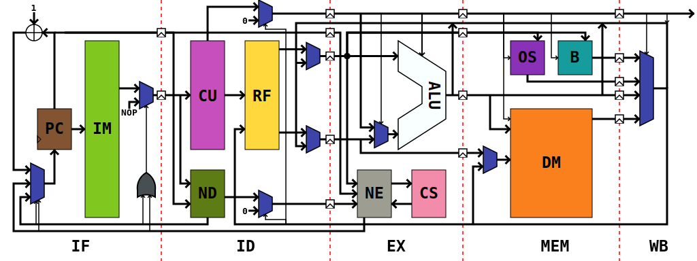

# Minecraft-Redstone-MCU

Resources for the MCU for the central museum of [my Minecraft 1.16 survival save](https://github.com/lovexyn0827/0827-Public-Notes/tree/master/1.16-Survival), including complete source code of the assembler, programs, and Verilog implementation.

Unless otherwise states, all source code in this repository is published under CC-0.

> Macrocontroller Units are also MCUs, isn't it?

Contents:

- How to Get Started
- Hardware Architecture
- ISA and Assembly Language
- Peripherals
- Toolchain
- Example Programs

## How to Get Started

## Hardware Architecture




### Overview

 * A small computer following the Harvard's architecture (i.e. separate storage for data and instruction).
 * Classic five-staged pipelined implementation.
 * RISC-like instruction set, fixed 20-bit, or else we have to struggle with microcode or FSMs. :shrug:
 * 16 8-bit registers, with read-only `r0` storing constant 0.
 * A 8-bit data-path, 8-bit SRAM address, but 12 bit addressing space for program ROM.
 * Unified address space of SRAM and display RAM, possibly with a DMA.
 * 4096 words of ROM, with lower 3072 of which for program and 1024 for fixed constant.
 * Memory-mapped IO, through CSRs.
 * Hardware glyph library & stack with a visible pointer.

### Modules

- Core: A 8-bit RISC core with a 5 staged instruction pipeline.
  - PC (Program Counter): A 12-bit register for the address from which the next instruction is being fetched.
  - CU (Control Unit): Generates controlling signals for the main data path.
  - ND (Next-PC Logic at ID Stage): Generates controlling signals for control flow transferring instructions at the Instruction Decode stage.
  - RF (Register File)
  - ALU (Arithmetics Logic Unit)
  - NE (Next-PC Logic at EX stage): Generates controlling signals for control flow transferring instructions at the Execution stage.
  - CS (Call Stack): A 8 level and 12-bit wide stack for return addresses of subroutine calls.
  - OS (Operand Stack): A 32 level and 8-bit wide stack for operands / data.
- IM (Instruction Memory): A 20-bit ROM for up to 4096 instructions.
- DM (Data Memory): A 256 * 8-bit RAM for runtime data. Also known as SRAM (System RAM, we do not mandate it to be a Static RAM if one could implement it in a dynamic form).
- B (Bus): An external bus on which up to 1024 peripherals (CSRs) may attach.

### Memory Mapping

We have three separate address space for instructions, stack, CSRs and data under manipulation.

Bytes can be transfered between address spaces with some CSRs.

#### Instrument Memory

`````````
-------------------- 0xFFF
+  Sys. Routines   +
-------------------- 0xC00
+  User Constants  +
-------------------- 0x800
+                  +
+   User Programs  +
+                  +
-------------------- 0x000
`````````

Descriptions:

- User programs: User-defined program code. 
  - The program starts running at `0x010`. 
  - Lowest 4 words are for instruction vectors.
- User constants: User-defined constants. (e.g. Sine tables)
- System routines: Read-only region of code of system utilities. (e.g. Printing glyphs to the screen)

Note that this lower 2 KB and higher 1 KB for instructions of this region is addressed by 20-bit words (i.e. not  byte-addressable), and the middle 1 KB for constants is addressed by 8-bit bytes.

#### Operand Stack

No specific structure, but a (theoretically unbounded, but physically bounded by the length of `SP` register) linear memory region with 8-bit words.

#### Call Stack

Similar to the operand stack, but it is pointed by the `CSP` register and consists of 12-bit words.

#### IO Ports (CSRs)

The CSRs (Control State Registers) reside in the address range of `0x000 - 0x3FF` of the IO port space, most of which is reserved for future extension.

Unlike GPRs (i.e. `r0 - r7`), CSRs cannot be interacted directly with any instruction other than `INCSR` and `OUTCSR`.

The complete list of CSRs:

`````````
Addr.	Name  	I/O	Description
0x00-01	PC		I	Program counter
0x80	IRQ		I	Active IRQ selected by hardware
0x81	CSW		I	Control status sord
0x82-83	INTCFG	O	Interrupt config
0x84-85	GPICFG	O	General purpose input ports config
0x86-87 GPOCFG	O	General purpose output ports config
0x88-89 DPTR	O	R/W address or constant area
0x8A-8B	IMLCK	O	Protection status of constant area
0x8C	IMCTRL	O	Control status of constant area	
0x8D	IMDATA	I	Data buffer for the word to R/W into constant area
0x8E	GPIBUF	I	General purpose input buffer
0x8F	GPOBUF	O	General purpose output buffer
0x90-97	GPIBIT	I	Per-bit access of GPI ports
0x98-9F	GPIBIT	O	Per-bit access of GPO ports
`````````

Unlisted addresses are not assigned to any hardware backend, thus, any operation on them will be no-op.

#### Data Memory

``````
-------------------- 0xFF
+    Display RAM   +
-------------------- 0xD0
+                  +
+   Ordinary Mem   +
+                  +
-------------------- 0x00
``````

### Interrupts

There can be up to 2 interrupt sources in the MCU. No priority can be specified, but one may mask some interrupt sources or assign them to GPI pins to detect various edges.

This feature may be dropped if it takes to much to switch between contexts. (`INTPC`, etc.?)

We are using a semi-software interruption handling, that is, as interruptions arrives, the hardware invokes the main interruption handler located in the system routine area, uses it to push `r1` - `r6` into the stack for later software restoration and further transfer its control to the upcoming handler attached to the IRQ number proposed by the priority decoder.

### Instruction Pipeline

We have implemented our MCU core with a classic five-staged instruction pipeline, that is:

- Instruction Fetching (IF): 
  - Fetches the instruction pointed by PC from IM.
  - Increments PC, or jump if any instruction requires.
- Instruction Decoding (ID):
  - Decodes the instruction fetched, and emits controlling signals and read RF.
  - Handles forwarding logic.
  - Calculates `NextPC` for `JMP` instruction.
- Execution (EX):
  - ALU works.
  - Calculates `NextPC` for other control flow related instruction.
  - Pushes into / pops from the call stack.
- Memory (MEM):
  - Reads from / writes to the SRAM or bus.
  - Pushes into / pops from the operand stack.
- Writing Back (WB):
  - Writes pending modifications to RF.

#### Timing Behaviors of The Pipeline

- Stalls for 1 CP immediately after any instruction potentially referencing the register being written to by its previous instruction transferring some "stored" data to the RF (i.e. Any instruction that have a nonzero `rs` or `rt`, where all instructions are assumed to be of R-Type, and `R[rs]` or `R[rt]` is the same register being written to by the previous instruction, and has a previous instruction reading from SRAM, operand stack, or CSRs.).
- Stall for 1 CP immediate after any unconditional jumps, including `INVOKE` and `RET`.
- Stall for 2 CPs immediately after any conditional branches that is taken.

## ISA and Assembly Language

This MCU supports 35 instructions, all of which are 20-bits-long, and can be categorized into following types:

```````
         98765432109876543210
R-Type: |opc| rs| rt| rd|fnc| (4 + 4 + 4 + 4 + 4)
I-Type: |opc| rs| rt| imm_8 | (4 + 4 + 4 + 8)
B-Type: |opc| rs|f|  imm_10 | (4 + 4 + 2 + 10)
J-Type: |opc| rs|  imm_12   | (4 + 4 + 12)
```````

> 20-bits instruction may seem weird, but it is an possibly an optimal compromise after trying 16-bits designs but resulting in insufficient number of GPRs and complex jumping instructions. By the way, we have even once consider 19-bit instructions, as you can see in earlier commits.

### Design Considerations

- We have no addition and subtraction with carry, which require us to use twice more instructions (in RISC-V-style) and thus making arithmetics between long integers twice slower. However, we can free us from struggling with flags.
- We have no explicit `SUBI` instructions, since the assembler can easily help us to translate it to corresponding `ADDI`s. The same applies to `NOP`, etc.
- Previously we have even no direct jump instruction that covers all 12-bits instruction memory spaces at all, instead, we have only one capable for jumping within up to $\pm 512$ words, which is `JMP`. That is also fine concerning that most direct jumps (rather than subroutine calls) are local, i.e. within a small memory area within the current routine, and $\pm 512$ words will be more than useful since most loop bodies span only a few dozens of instructions and even 8086 which runs much longer programs works well with $\pm 127$ jumps.

### R-Type Instructions

```````
ADD   : 0000 xxxx xxxx xxxx 0000 - R[rd] <- (R[rs] + R[rt])[7:0]
SUB   : 0000 xxxx xxxx xxxx 0001 - R[rd] <- (R[rs] - R[rt])[7:0]
AND   : 0000 xxxx xxxx xxxx 0010 - R[rd] <- R[rs] & R[rt]
OR    : 0000 xxxx xxxx xxxx 0011 - R[rd] <- R[rs] | R[rt]
XOR   : 0000 xxxx xxxx xxxx 0100 - R[rd] <- R[rs] ^ R[rt]
SAR   : 0000 xxxx xxxx xxxx 0101 - R[rd] <- (R[rs] >> R[rt][2:0])[7:0]
SHL   : 0000 xxxx xxxx xxxx 0110 - R[rd] <- (R[rs] << R[rt][2:0])[7:0]
SHR   : 0000 xxxx xxxx xxxx 0111 - R[rd] <- (R[rs] >>> R[rt][2:0])[7:0]
SET   : 0000 xxxx xxxx xxxx 1000 - R[rd] <- (R[rs] & ~(1 << R[rt]))[7:0]
CLR   : 0000 xxxx xxxx xxxx 1001 - R[rd] <- (R[rs] | (1 << R[rt]))[7:0]
PUSH  : 0000 xxxx 0000 0000 1010 - OperandStack.Push(R[rs])
POP   : 0000 0000 0000 xxxx 1011 - R[rd] <- OperandStack.Pop()
CMPU  : 0000 xxxx xxxx xxxx 11md - @ = { =, !=, >, < }[md]; R[rd] <- R[rs] @ R[rt] ? 1 : 0
```````

### I-Type Instruments

``````
SARI  : 0001 xxxx xxxx xxx00101 - R[rt] <- (R[rs] >> imm[7:5])[7:0]
SHLI  : 0001 xxxx xxxx xxx00110 - R[rt] <- (R[rs] << imm[7:5])[7:0]
SHRI  : 0001 xxxx xxxx xxx00111 - R[rt] <- (R[rs] >>> imm[7:5])[7:0]
SETI  : 0001 xxxx xxxx xxx01000 - R[rt] <- (R[rs] | (1 << imm[7:5]))[7:0] 
CLRI  : 0001 xxxx xxxx xxx01001 - R[rt] <- (R[rs] & ~(1 << imm[7:5]))[7:0]
ILOAD : 0010 xxxx xxxx xxxxxxxx - R[rt] <- Mem[(R[rs] + imm)[7:0]]
ISTORE: 0011 xxxx xxxx xxxxxxxx - Mem[(R[rs] + imm)[7:0]] <- R[rt]
CMPIU : 01md xxxx xxxx xxxxxxxx - @ = { =, !=, >, < }[md]; R[rt] <- R[rs] @ imm ? 1 : 0
ADDI  : 1000 xxxx xxxx xxxxxxxx - R[rt] <- (R[rs] + imm)[7:0]
ANDI  : 1010 xxxx xxxx xxxxxxxx - R[rt] <- R[rs] & imm
ORI   : 1011 xxxx xxxx xxxxxxxx - R[rt] <- R[rs] | imm
XORI  : 1100 xxxx xxxx xxxxxxxx - R[rt] <- R[rs] ^ imm
``````

### B-Type Instruments

``````
BEQZ  : 1110 xxxx 00 xxxxxxxxxx - if (R[rs] == 8'b0)  PC <- (PC + SignExt(imm))[11:0]
BNEZ  : 1110 xxxx 01 xxxxxxxxxx - if (R[rs] != 8'b0)  PC <- (PC + SignExt(imm))[11:0]
BGEZ  : 1110 xxxx 10 xxxxxxxxxx - if (R[rs] <= 8'h7F) PC <- (PC + SignExt(imm))[11:0]
BLTZ  : 1110 xxxx 11 xxxxxxxxxx - if (R[rs] >= 8'h80) PC <- (PC + SignExt(imm))[11:0]
RET   : 1111 0000 00 000000000x - PC <- (CallStack.Pop() + (x ? 1 : 0)); if (~x) INTR <- 0
JMP   : 1111 0000 01 xxxxxxxxxx - PC <- (PC + SignExt(imm))[11:0]
INCSR : 1111 xxxx 10 xxxxxxxxxx - R[rs] <- CSR[imm]
OUTCSR: 1111 xxxx 11 xxxxxxxxxx - CSR[imm] <- R[rs]
``````

### J-Type Instruments

```````
LJMP  : 1001 xxxx xxxxxxxxxxxx - PC <- (imm + SignExt(R[rs]))[11:0]
INVOKE: 1101 xxxx xxxxxxxxxxxx - CallStack.Push(PC); PC <- (SignExt(R[rs]) + imm)[11:0]
```````

### Assembly Language

#### Syntax Specification

``````````
Assembly Program := Line*

Line := [(InsnLine | ConstLine | VariableLine | ORGLine | PointerLine)][%Comment]\n

InsnLine := [Label:] [Insn]
ConstLine := CONST Constant Expr
VariableLine := DB Variable Expr
ORGLine := ORG (IM | SRAM) Expr
PointerLine := PTR Pointer Expression

Label := Identifier
Constant := Identifier
Variable := Identifier
Pointer := Identifier

Insn := ALUInsn | ImmALUInsn | SignedImmALUInsn | MemoryInsn 
		| StackInsn | JmpInsn | BranchInsn | SimpleInsn | CMPInsn 
		| CMPIInsn | IOInsn
ALUInsn := ALUInsnOpcode Reg Reg Reg
ImmALUInsn := ImmALUInsnOpcode Reg Reg Imm
MemoryInsn := MemoryInstOpcode Reg MemAddr
StackInsn := StackInsnOpcode Reg
JmpRegInsn := JmpRegInsnOpcode JmpRegTarget
JmpInsn := JmpInsnOpcode JmpTarget
BranchInsn := BranchInsnCode Reg JmpTarget
RetInsn := SimpleInsnOpcode [I]
CMPInsn := CMPInsnOpcode Reg Reg Cond Reg
CMPIInsn := CMPIInsnOpcode Reg Reg Cond Imm
IOInsn := IOInsnOpcode Reg IOPort

Reg := r0 | r1 | ... | r15
JmpRegTarget := Label | Reg\(Expr\)
JmpTarget := Expr
MemAddr := Variable | Reg\(Expr\)
Cond := EQ | NE | GT | LT
IOPort := Expr

ALUInsnOpcode := ADD | SUB | AND | OR | XOR | SAR | SHL | SHR | SET | CLR
ImmALUInsnOpcode := ADDI | ANDI | ORI | XORI | SARI | SHLI | SHRI | SETI | CLRI
MemoryInsnOpcode := ILOAD | ISTORE
StackInsnOpcode := PUSH | POP
JmpInsnOpcode := JMP
JmpRegInsnOpcode := LJMP | INVOKE
BranchInsnCode := BEQZ | BNEZ | BGTZ | BLTZ
RetInsnOpcode := RET
CMPInsnOpcode := CMPU
CMPIInsnOpcode := CMPIU
IOInsnOpcode := INCSR | OUTCSR

Imm := Expression
Expr := [\(](Expr Operator Expr) | Num [\)]
Operator := +|-|*|/|&|^|\|
Num := ((+|-)DecNumU) | 0xHexNum | 0bBinNum | Label | &Variable | Constant
Identifier := [A-Za-z_][A-Za-z0-9_]*
``````````

#### Semiatics

We are going to give only a few examples, by which you will easily guess what applies to other instructions:

`````````
ADD		r4, r5, r6		; r4 <- r5 + r6
ANDI	r1, r2, 0x80	; r1 <- r2 & 0x80
ADDI	r1, r2, -100	; r1 <- r2 - 100
ISTORE	r2, 18(r9)		; Mem[r9 + 18] <- r2
POP		r7				; r7 <- Stack[SP--]
JMP		lbl				; PC <- AddressOf(lbl)
BEQZ	r8, 0x827(r8)	; if (r8 == 0) PC <- r8 + 0x827
RET						; PC <- CallStack[CSP--]
CMP		r2, r11 EQ r15	; r2 <- r11 == r15 ? 1 : 0
CMP		r2, r11 LT 0x80	; r2 <- r11 < 0x80 ? 1 : 0
INCSR	r8, 0x80		; r8 <- CSR[0x80]
`````````

> Hint: registers go first if any.

#### Example program

```````
	CONST GPIB 0x8E
	CONST GPOB 0x8F

START:
	INCSR	R1, GPIB
	ADDI	R2, R0, 0
LOOP:
	ADD		R2, R2, R1
	ADDI	R1, R1, -1
	BNEZ	R1, LOOP
	OUTCSR  R2, GPOB
	JMP		START
```````

## Peripherals

## Toolchain

### Assembler

`````
asm [-t] [-v] [-s] [-o file] [-f format] -i input

-t: Run tests
-v: Version
-s: Show binary
-o: Assemble and output
-f: Output format (default: bin)
    b: Binary IM image of 32-bit words
    v: Verilog module of IM
    l: Logisim ROM image file
-i: Input
`````


### Simulator

A GUI simulator written in Java, to run and debug compiled programs interactively.

GUI layout:

``````
|=============================|
|       Debugging Tools       |
|=============================|
|       |          |          |
|       |   SRAM   |   CSR    |
| Insns |=====================|
|       | Reg |  S |   Disp   |
|       |     |  S |          |
|=============================|
``````

### Program Loader

Generates ROM schematics from binary.

### Reduced C Compiler (MCMCUCC)

A simple compiler of a specialized and reduced dialect of C:

- `if`, `for`, `while`, `do` and `switch` blocks, basic expressions;
- Functions and `inline` keyword;
- Only 8-bit integer types - `uint8_t`, `int8_t`, and their pointers - are supported;
- `const` keyword - `const` global variables won't take up SRAM spaces, but cannot be pointed.
- Operators for set & unset: `<|` and `<&`;
- `likely` and `unlikely` keyword for conditional blocks, and static branch prediction.
- No short circuit logical operator;
- No custom types (`typedef`, `enum`, `structs` or `union`), or string literals;
- Arrays declaration is allowed, but initialization is unsupported.
- All locals are stored in registers - compilation may fail with too many locals;
- Address of external function prototypes: `uint8_t func(uint8_t x) = 0x100;`;
- `goto` and function call with a 8-bit variable offset: `goto label + var;`, `(func + var) (x);`;
- No preprocessor support.
- Only one compilation unit is allowed.
- Explicit `register` keyword works for global variables;
- Minimal standard library: `incsr()`, `outcsr()`, `push()`, `pop()`;

It compiles into assembly instead of binaries to allow further manual modification.

One should understand how it compiles to code effectively.

> We don't enforce strictness as long as the grammar specification is understandable.

Lexical grammar:

```````
token 		:= keyword | identifier | number | punctuator

keyword 	:= break | case | const | continue | default | do | else 
				| enum | for | goto | if | inline | int8_t | int16_t | 
				| likely | return | sizeof | switch | void | while

identifier	:= nodigit 
				| (identifier nodigit) 
				| (identifier digit)
nondigit	:= _ | a | ... | z | A | ... | Z
digit		:= 0 | ... | 9

constant	:= int-const | char-const
int-const	:= dec-const | oct-const | hex-const
dec-const	:= nz-digit | decimal-const digit
octal-const	:= 0 | octal-const octal-digit
hex-const	:= hex-prefix hex-digit | hex-const hex-digit
hex-prefix	:= 0x | 0X
nz-digit	:= 1 | ... | 9
oct-digit	:= 0 | ... | 7
hex-digit	:= 0 | ... | 9 | A | ... | F | a | ... | f
sign		:= + | -
char-const	:= ' c-char-seq '
c-char-seq	:= c-char | c-char-seq c-char
c-char		:= Any character except ' and \ | escape-seq
escape-seq	:= \' | \" | \? | \\ | \a | \b | \f | \n | \r | \t | \v

punctuator	:= Any of
				[ ] ( ) { } ++ -- & * + - ~ ! / % << >> < > <= >= == !=
				^ | && || ? : ; = *= /= %= += -= <<= >>= &= ^= |= ,
```````

Phrase structure grammar (Only `|` and `?` must be escaped)

``````
// ****** Expressions ******
primary-expr	:= identifier | constant | ( expr )
postfix-expr	:= primary-expr 
                    | postfix-expr [ expr ]
                    | postfix-expr ( expr )
                    | postfix-expr ++
                    | postfix-expr --
unary-expr		:= postfix-expr
					| ++ unary-expr
					| -- unary-expr
					| unary-op unary-expr
					| sizeof unary-expr
					| sizeof ( type-name )
unary-op		:= & * + - ~ !
cast-expr		:= unary-expr
					| \( type-name \) cast-expr
mult-expr		:= cast-expr
					| mult-expr * cast-expr
					| mult-expr / cast-expr
					| mult-expr % cast-expr
additive-expr	:= mult-expr
					| additive-expr + mult-expr
					| additive-expr - mult-expr
shift-expr		:= additive-expr
					| shift-expr << additive-expr
					| shift-expr >> additive-expr
relation-expr	:= shift-expr
					| relation-expr < shift-expr
					| relation-expr > shift-expr
					| relation-expr <= shift-expr
					| relation-expr >= shift-expr
equality-expr	:= relation-expr
					| equality-expr == relation-expr
					| equality-expr != relation-expr
and-expr		:= equality-expr
					| and-expr & equality-expr
xor-expr		:= and-expr
					| xor-expr ^ and-expr
or-expr			:= xor-expr
					| or-expr \| xor-expr
land-expr		:= or-expr
					| land-expr && or-expr
lor-expr		:= land-expr
					| lor-expr \|\| land-expr
cond-expr		:= lor-expr
					| lor-expr \? expr : cond-expr
assign-expr		:= cond-expr
					| unary-expr assign-op assign-expr
assign-op		:= = | *= | /= | %= | += | -= | <<= | >>= | &= | ^= | \|=
expr			:= assign-expr | expr , assign-expr
const-expr		:= cond-expr

// ****** Declarations ******
decl			:= decl-spec init-decl-list? ;
decl-spec		:= storage-cl-spec decl-spec?
					| type-spec decl-spec?
					| const decl-spec?
					| inline decl-spec?
init-decl-list	:= init-decl | init-decl-list, init-decl
init-decl		:= declarator | declarator = initializer
storage-cl-spec	:= auto | register
type-spec		:= void | int8_t | uint8_t
declarator		:= pointer? drct-declarator
drct-declarator	:= identifier
					| ( declarator )
					| drct-declarator [ const-expr ]
					| drct-declarator [ const? * ]
					| drct-declarator ( param-list )
					| drct-declarator ( identifier-list )
pointer			:= * const? | * const? pointer
param-list		:= param-decl | param-list param-decl
param-decl		:= decl-spec declarator
					| decl-spec abst-declarator
identifier-list	:= identifier | identifier-list , identifier
type-name		:= spec-qual-list abst-declarator?
abst-declarator	:= pointer
					| pointer? drct-abst-decl
drct-abst-decl	:= ( abst-declarator )
					| drct-abst-decl? ( param-list? )
initializer		:= assign-expr

// ****** Statements ******
stmt			:= labeled-stmt
					| comp-stmt
					| expr-stmt
					| select-stmt
					| iter-stmt
					| jump-stmt
likelyhood-spec	:= likely | unlikely
labeled-stmt	:= identifier : stmt
					| likelyhood-spec case const-expr : stmt
					| likelyhood-spec default : stmt
comp-stmt		:= { block-item-list? }
block-item-list	:= block-item
					| block-item-list block-item
block-item		:= decl | stmt
expr-stmt		:= expr? ;
select-stmt		:= likelyhood-spec? if ( expr ) stmt
					| likelyhood-spec? if ( expr ) stmt likelyhood-spec? else stmt
					| switch ( expr ) stmt
iter-stmt		:= while ( expr ) stmt
					| do stmt while ( expr ) ;
					| for ( expr? ; expr? ; expr? ) stmt
					| for ( decl expr? ; expr? ) stmt
jump-stmt		:= goto identifier ;
					| continue ;
					| break ;
					| return expr? ;

// ****** Larger Building Blocks ******
compile-unit	:= extern-decl | compile-unit
extern-decl		:= func-def | decl
func-def		:= decl-spec declarator decl-list? comp-stmt
decl-list		:= decl | decl-list decl
``````

## Example Programs

### Basic Calculator

### Real-time Clock

### Quadratic Function Graph

### Square Root

### Reed-Solomon ECC

Compiles from:

``````c
#include <stdint.h>

#define GF (256)
#define PP (0b00011101)
#define K (2)
#define N (3)

uint8_t gf256_mul_on_fly(uint8_t x, uint8_t y) {
    uint8_t z = 0;
    int8_t i = 7;
    do {
        uint8_t t = z << 1;
        if (z & 0x80) {
            t = t ^ PP;
        }

        if ((x >> i) & 1) {
            t = t ^ y;
        }

        z = t;
    } while(--i >= 0);
    return z;
}

void calc_rs_ecc(uint8_t *dat, uint8_t *gp) {
    uint8_t *ecc = dat + N;
    int8_t i = N - 1;
    do {
        int8_t x = ecc[0] ^ dat[i];
        int j = 0;
        do {
            ecc[j] = ecc[j + 1] ^ gf256_mul_on_fly(gp[K - j - 1], x);
        } while (++j < K);
    } while (--i >= 0);
}
``````

And to:

````````` 
	CONST	PP	00101101
	CONST	N	12
	CONST	K	12
	CONST	M	255

	DB	CW	N + K
	DB	GP	K + 1
	
	PTR	ECC		CW + N
	PTR ECCMOST	ECC + K - 1
	PTR GPTOP	GP + K - 1

	% Main procedure
	% Affects r1 - r8

CALC_RS_ECC:
	ADDI	r1 r0, N - 1
PER_DATA_WORD:
	ILOAD	r2 r0(ECCMOST)
	ILOAD	r3 r1(CW)
	XOR		r2 r2, r3
	ADDI	r3 r0, r0
PER_REGISTER:
	SUB		r4 r0, r3
	ILOAD	r4 r4(GPTOP)
	INVOKE	GF256_MUL
	ILOAD	r4 r3(ECC + 1)
	XOR		r4 r4, r5
	ISTORE	r4 r3(ECC)
	ADDI	r3 r3, 1
	ADDI	r4 r3, K
	BLTZ	r3 PER_REGISTER
	ADDI	r1 r1, -1
	BGTZ	r3 PER_DATA_WORD
	RET
	
	% End of main procedure

	% r5 <- GF256_MUL(r2, r4)
	% Affects r5, r6, r7, r8
GF256_MUL:
	ADD		r5 r0, r0
	ADDI	r6 r0, 7
PER_BIT:
	SHLI	r7 r5, 1
	ANDI	r8 r5, 0x80
	JEQZ	r8, SKIP_XOR_PP
	XORI	r7, r7, PP
SKIP_XOR_PP:
	SHR		r8, r2, r6
	ANDI	r8, r8, 1
	JEQZ	r8, SKIP_XOR_PP
	XORI	r7, r7, r4
SKIP_ADD:
	ADDI	r5, r7, r0
	ADDI	r6, r6, -1
	BLTZ	r6, GF256_MUL_END
	JMP		PER_BIT
GF256_MUL_END:
`````````

### Data Matrix Generator

## Note
